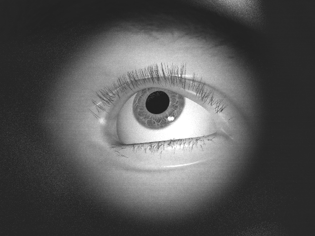
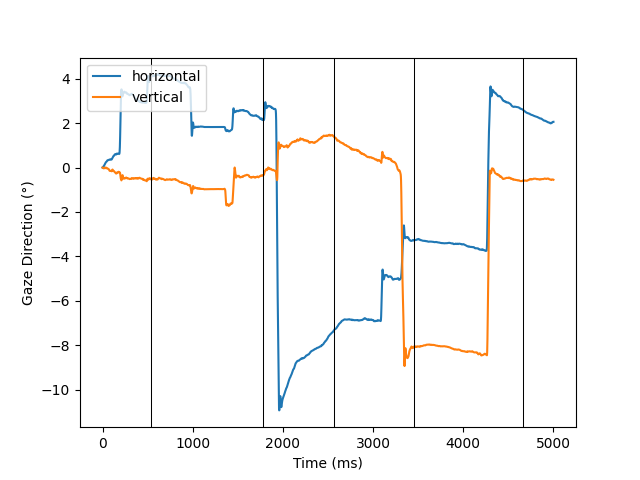
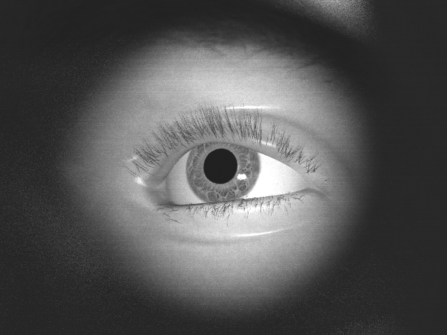
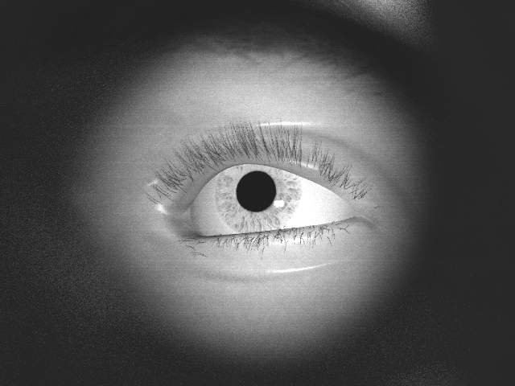
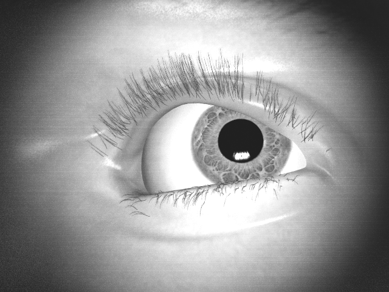
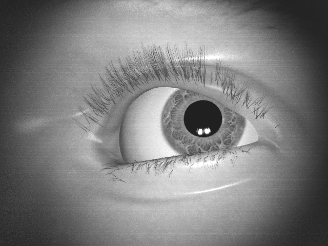

# Eye Animation using synthesized gaze samples
This repository is the code base of a Hiwi Project 

* Author: YeonJoo Cho 

## Abstract
This project generates realistic eye animation, mdifying an existing eye-rendering [framework](https://www.cl.cam.ac.uk/research/rainbow/projects/eyerender/)
 

## Requirements  

- #### Download eye model from the official [repository](https://github.com/LeszekSwirski/eyemodel)

- #### Download [BlenderProc](https://github.com/DLR-RM/BlenderProc)
    - BlenderProc2 is the main platform to deploy the 3D scene and capture images
    - Good amount of [Tutorials](https://github.com/DLR-RM/BlenderProc/tree/main/examples) are provided for learning the tool
   

## Rendering 

To sample images, simply run:

```
blenderproc run render.py
```
To debug and deploy the 3D scene, simply run:

```
blenderproc debug render.py
``` 

## Features/Output
1. Render images from the given gaze data series in (horizontal, vertical) 
<br><br> 
2. Plot the data graph with an option to mark timesteps
<br><br> 
3. Render video
<br><br> 

## Useful Eye-Model options
- Eye-Model Setting 
    - Iris color (dark/light)
    <br> <br> 
    - Eye closedness
    - Eye radius (Default:12)/Pupil radius (Default:2 / Max:3.58)
    - Eye position, up vector
- Lighting Setting
    - Options: ["location", "target", "type", "size", "strength", "view_angle"]
    - Example (Using 4 lights / Using spotlights)
    <br> <br> 
- Camera Setting
    - Options: ["camera_position", "camera_target", "image_size", "focal_length", "camera_up", "focus_distance", "fstop", "camera_up"]

## Sidenotes
- To modify and test the 3D scene, make changes in 'eyemodel/blender_script.py.template'  
- Issues during Blender installaion, Provided APIs, Further settings can be resolved in 'eyemodel/__init__.py'
- For the project left-eye is only deployed, thus all adjustments are only made for the left-eye
- Current setting for the left-eye rotation is set to Euler Rotation in 'YZX'(Pitch-Roll-Yaw)
``` 
eul.rotate_axis('Y', math.radians(input_eye_target[0])) # horizontal(Pitch)
eul.rotate_axis('X', math.radians(90 + input_eye_target[1])) # vertical(Yaw)
```
- Setting the origin of the object is necessary for proper rotation 
```
# Change origin of the left eye
bpy.context.view_layer.objects.active = bpy.data.objects["eye.L"]
bpy.data.objects["eye.L"].select_set(True)
bpy.ops.object.origin_set(type='ORIGIN_CENTER_OF_VOLUME')
```

